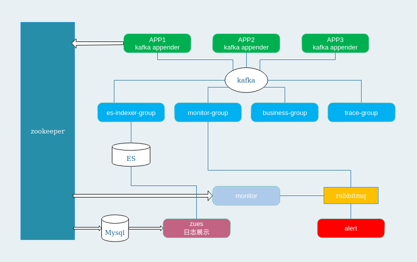
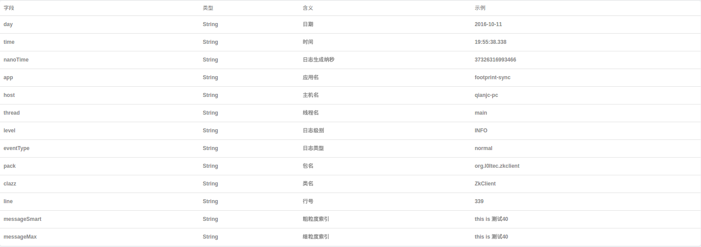

# 项目介绍
监控组的公用基础包
# 架构

- APP: 接入pugna的系统会通过kafkaAppender向kafka写入日志
- es-indexer-group: kafka的es消费组，读取kafka的数据并批量bulk到es
- monitor-group: kafka的监控消费组，app在日志中进行各种event埋点（如：第三方异常报警、请求耗时异常报警等）
- business-group: kafka的业务消费组，如：智慧足迹接口等
- trace-group: 通过日志进行rpc调用trace跟踪（dapper论文）
- es: 日志存储db，并建立相关索引
- zookeeper: app注册中心
- monitor: 监控中心，监听zookeeper注册中心中相应的节点变化进行监控报警
- rabbitmq: 监控报警缓冲队列
- alert: 具体报警手段，包括邮件和微信

## es字段
