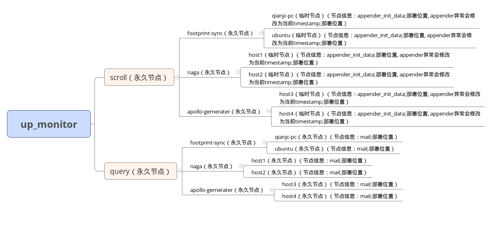

# 项目介绍
日志生产系统，包括应用系统的日志入队列、埋点、应用系统注册等
- 自定义一些log框架的appender，包含logback和log4j
- 向注册中心注册应用
- 应用埋点进行监控报警
- rpc trace数据产生器

# 使用方式
## logback
### 依赖
gradle或者pom中加入skyeye-client的依赖

``` xml
compile "skyeye:skyeye-client-logback:1.3.0"
```
### 配置
在logback.xml中加入一个kafkaAppender，并在properties中配置好相关的值，如下（rpc这个项目前支持none和dubbo，所以如果项目中有dubbo服务的配置成dubbo，没有dubbo服务的配置成none，以后会支持其他的rpc框架，如：thrift、spring cloud等）：

``` xml
<property name="APP_NAME" value="your-app-name" />
<!-- kafka appender -->
<appender name="kafkaAppender" class="com.jthink.skyeye.client.logback.appender.KafkaAppender">
    <encoder class="com.jthink.skyeye.client.logback.encoder.KafkaLayoutEncoder">
      <layout class="ch.qos.logback.classic.PatternLayout">
        <pattern>%d{yyyy-MM-dd HH:mm:ss.SSS};${CONTEXT_NAME};HOSTNAME;%thread;%-5level;%logger{96};%line;%msg%n</pattern>
      </layout>
    </encoder>
    <topic>app-log</topic>
    <rpc>none</rpc>
    <zkServers>riot01.jthink.com:2181,riot02.jthink.com:2181,riot03.jthink.com:2181</zkServers>
    <mail>xxx@xxx.com</mail>
    <keyBuilder class="com.jthink.skyeye.client.logback.builder.AppHostKeyBuilder" />

    <config>bootstrap.servers=riot01.jthink.com:9092,riot02.jthink.com:9092,riot03.jthink.com:9092</config>
    <config>acks=0</config>
    <config>linger.ms=100</config>
    <config>max.block.ms=5000</config>
  </appender>
```
## log4j
### 依赖
gradle或者pom中加入skyeye-client的依赖

``` xml
compile "skyeye:skyeye-client-log4j:1.3.0"
```
### 配置
在log4j.xml中加入一个kafkaAppender，并在properties中配置好相关的值，如下（rpc这个项目前支持none和dubbo，所以如果项目中有dubbo服务的配置成dubbo，没有dubbo服务的配置成none，以后会支持其他的rpc框架，如：thrift、spring cloud等）：

``` xml
<appender name="kafkaAppender" class="com.jthink.skyeye.client.log4j.appender.KafkaAppender">
        <param name="topic" value="app-log"/>
        <param name="zkServers" value="riot01.jthink.com:2181,riot02.jthink.com:2181,riot03.jthink.com:2181"/>
        <param name="app" value="xxx"/>
        <param name="rpc" value="dubbo"/>
        <param name="mail" value="xxx@xxx.com"/>
        <param name="bootstrapServers" value="riot01.jthink.com:9092,riot02.jthink.com:9092,riot03.jthink.com:9092"/>
        <param name="acks" value="0"/>
        <param name="maxBlockMs" value="2000"/>
        <param name="lingerMs" value="100"/>

        <layout class="org.apache.log4j.PatternLayout">
            <param name="ConversionPattern" value="%d{yyyy-MM-dd HH:mm:ss.SSS};APP_NAME;HOSTNAME;%t;%p;%c;%L;%m%n"/>
        </layout>
    </appender>
```
## log4j2

### 依赖

gradle或者pom中加入skyeye-client的依赖

``` xml
compile "skyeye:skyeye-client-log4j2:1.3.0"
```

### 配置

在log4j2.xml中加入一个KafkaCustomize，并在properties中配置好相关的值，如下（rpc这个项目前支持none和dubbo，所以如果项目中有dubbo服务的配置成dubbo，没有dubbo服务的配置成none，以后会支持其他的rpc框架，如：thrift、spring cloud等）：

```xml
<KafkaCustomize name="KafkaCustomize" topic="app-log" zkServers="riot01.jthink.com:2181,riot02.jthink.com:2181,riot03.jthink.com:2181"
                mail="qianjc@unionpaysmart.com" rpc="none" app="${APP_NAME}">
  <ThresholdFilter level="info" onMatch="ACCEPT" onMismatch="DENY"/>
  <PatternLayout pattern="%d{yyyy-MM-dd HH:mm:ss.SSS};${APP_NAME};HOSTNAME;%t;%-5level;%logger{96};%line;%msg%n"/>
  <Property name="bootstrap.servers">riot01.jthink.com:9092,riot02.jthink.com:9092,riot03.jthink.com:9092</Property>
  <Property name="acks">0</Property>
  <Property name="linger.ms">100</Property>
</KafkaCustomize>
```

## 注意点

## logback
- logback在对接kafka的时候有个bug，[jira bug](https://jira.qos.ch/browse/LOGBACK-1328)，所以需要将root level设置为INFO（不能是DEBUG）

### log4j
由于log4j本身的appender比较复杂难写，所以在稳定性和性能上没有logback支持得好，应用能使用logback请尽量使用logback
### rpc trace
使用自己打包的dubbox（[dubbox](https://github.com/JThink/dubbox/tree/skyeye-trace-1.3.0)），在soa中间件dubbox中封装了rpc的跟踪

``` shell
compile "com.101tec:zkclient:0.10"
compile ("com.alibaba:dubbo:2.8.4-skyeye-trace-1.3.0") {
  exclude group: 'org.springframework', module: 'spring'
}
```
### spring boot

如果项目使用的是spring-boot+logback，那么需要将spring-boot对logback的初始化去掉，防止初始化的时候在zk注册两次而报错，具体见我的几篇博客就可以解决：

http://blog.csdn.net/jthink_/article/details/52513963

http://blog.csdn.net/jthink_/article/details/52613953

http://blog.csdn.net/jthink_/article/details/73106745

## 应用注册中心设计
### zookeeper注册中心节点tree

- kafkaAppender初始化向zk进行app节点注册，并写入相关的信息
- kafkaAppender发生异常暂停工作会向app节点写入相关信息，以便监控系统能够实时感知并发送报警
- app正常或者异常退出后，zk中的app临时节点会消失，shutdownhook会正常运行，监控系统能够实时感知并发送报警
- zk中有永久节点用来记录app的最近一次部署信息

## 埋点对接
### 日志类型
| 日志类型             | 说明                        |
| :--------------- | :------------------------ |
| normal           | 正常入库日志                    |
| invoke_interface | api调用日志                   |
| middleware_opt   | 中间件操作日志(目前仅支持hbase和mongo) |
| job_execute      | job执行日志                   |
| rpc_trace        | rpc trace跟踪日志             |
| custom_log       | 自定义埋点日志                   |
| thirdparty_call  | 第三方系统调用日志                 |
### 正常日志

``` shell
LOGGER.info("我是测试日志打印")
```
### api日志

``` shell
// 参数依次为EventType(事件类型)、api、账号、请求耗时、成功还是失败、具体自定义的日志内容
LOGGER.info(ApiLog.buildApiLog(EventType.invoke_interface, "/app/status", "800001", 100, EventLog.MONITOR_STATUS_SUCCESS, "我是mock api成功日志").toString());
LOGGER.info(ApiLog.buildApiLog(EventType.invoke_interface, "/app/status", "800001", 10, EventLog.MONITOR_STATUS_FAILED, "我是mock api失败日志").toString());
```
### 中间件日志

``` shell
// 参数依次为EventType(事件类型)、MiddleWare(中间件名称)、操作耗时、成功还是失败、具体自定义的日志内容
LOGGER.info(EventLog.buildEventLog(EventType.middleware_opt, MiddleWare.HBASE.symbol(), 100, EventLog.MONITOR_STATUS_SUCCESS, "我是mock middle ware成功日志").toString());
LOGGER.info(EventLog.buildEventLog(EventType.middleware_opt, MiddleWare.MONGO.symbol(), 10, EventLog.MONITOR_STATUS_FAILED, "我是mock middle ware失败日志").toString());
```
### job执行日志

```
// job执行仅仅处理失败的日志（成功的不做处理，所以只需要构造失败的日志）, 参数依次为EventType(事件类型)、job 的id号、操作耗时、失败、具体自定义的日志内容
LOGGER.info(EventLog.buildEventLog(EventType.job_execute, "application_1477705439920_0544", 10, EventLog.MONITOR_STATUS_FAILED, "我是mock job exec失败日志").toString());
```

### 第三方请求日志

```
// 参数依次为EventType(事件类型)、第三方名称、操作耗时、成功还是失败、具体自定义的日志内容
LOGGER.info(EventLog.buildEventLog(EventType.thirdparty_call, "xx1", 100, EventLog.MONITOR_STATUS_FAILED, "我是mock third 失败日志").toString());
LOGGER.info(EventLog.buildEventLog(EventType.thirdparty_call, "xx1", 100, EventLog.MONITOR_STATUS_SUCCESS, "我是mock third 成功日志").toString());
LOGGER.info(EventLog.buildEventLog(EventType.thirdparty_call, "xx2", 100, EventLog.MONITOR_STATUS_SUCCESS, "我是mock third 成功日志").toString());
LOGGER.info(EventLog.buildEventLog(EventType.thirdparty_call, "xx2", 100, EventLog.MONITOR_STATUS_FAILED, "我是mock third 失败日志").toString());
```

